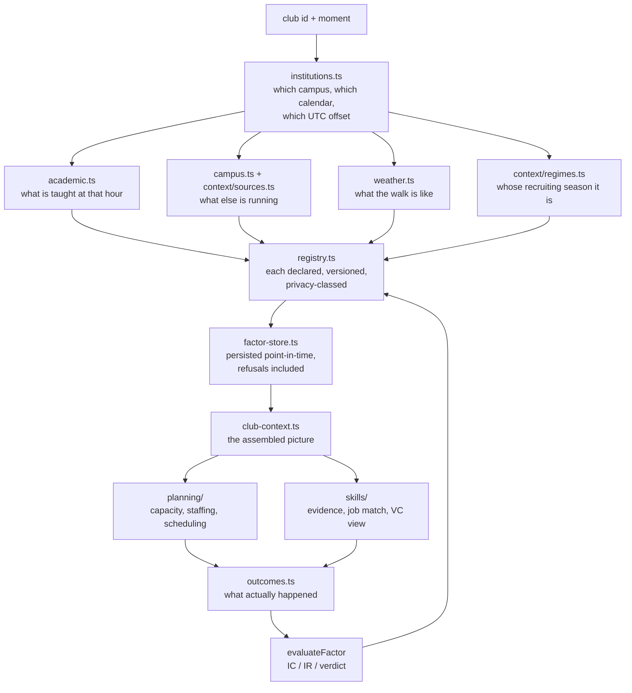

# 21 — The context intelligence system, assembled

*What was built against the specification in docs/20, how the pieces connect,
and — the part that matters most — what each one refuses to do.*

---

## 1. The chain, end to end



The loop closing at the bottom is the point. A factor that never gets evaluated
against an outcome is a guess with a version number.

---

## 2. What each layer refuses to do

This table is the honest summary of the system. Every row is enforced in code
and covered by a test, not stated as policy.

| Layer | Refuses to |
|---|---|
| `factors.ts` | register a factor with no compute function, no falsifiable hypothesis, or no point-in-time statement |
| `factors.ts` | register **any** person-scoped factor that declares `employer_evidence` or `sponsor_ranking` |
| `factors.ts` | register a person-scoped factor with no `explain()` or that the subject cannot see |
| `factor-store.ts` | hand a factor to a caller for a use it was never cleared for |
| `factor-store.ts` | return a value whose `observed_at` is after the read's `asOf` |
| `computeFactor` | return a number below the factor's declared minimum sample |
| `club-context.ts` | assume a normal week when no term is configured |
| `club-context.ts` | treat a missing roster as a clear hour, or a missing forecast as fair weather |
| `academic.ts` | report a course difficulty seen by fewer than three distinct people |
| `weather.ts` | move expected turnout by more than about 15% |
| `climatology` | call anything "normal" from fewer than 15 observations |
| `clubhealth.ts` | produce an index without 8 comparable clubs |
| `exposure.ts` | infer a career interest from behaviour |
| `skills/` | claim proficiency from a single episode |
| `skills/profiles.ts` | emit any number about a person to an external audience |
| `evidence.ts` | accept evidence observed before it happened |

---

## 3. The Factor Registry

The keystone. It exists because `SignalDef` carried metadata only: all 13
behavioural signals lived in one 160-line function coupled by string key, so
`halfLifeDays` was declared thirteen times and read zero times, and two signals
computed against action families that are never emitted — structurally
unreachable, reporting zero forever, with nothing to catch it.

A registry whose entries are metadata is a spreadsheet. Every factor here binds
to the function that computes it and declares what that function may read, so a
definition that cannot run is rejected rather than silently zero.

### The refusal ladder, applied centrally

```
missing_input     → a declared input was not supplied. NULL, never zero.
not_computable    → compute() declined, or threw.
insufficient_data → fewer observations than the factor declared it needs.
retired           → kept for replay, never recomputed.
```

Before this, every module implemented its own refusal — `MIN_PEERS = 8` in club
health, 3 peers in `peerPrior`, 15 observations in `climatology` — and a new
factor could simply forget. Now it cannot.

### Privacy as a type, not a policy

`privacy: "forbidden"` is a value in the union, and `defineFactor` throws on it.
The do-not-compute list from docs/11 §7 stops being a paragraph someone has to
remember and becomes a thing the compiler and the test suite know about.

The rule that matters most, from docs/10 §6 — *evidence, never a score* — is
enforced structurally: a person-scoped factor may not declare
`employer_evidence` or `sponsor_ranking`. Employers and investors receive
episodes, artifacts and outcomes. They never receive a number about a student.

---

## 4. The scale mismatch, made visible

`academicFactor` and `weatherFactor` return **multipliers on expected
headcount**. `forecast.ts` applies **additive log-odds to a conversion rate**.
These are different spaces. Multiplying one into the other is a silent bug.

Worse, both independently priced the academic calendar:
`ATTENDANCE_ADJUSTMENTS.finals` against `REGIME_TURNOUT` plus
`REGIME_BASELINE_PRESSURE`.

Two fixes, both tested:

1. Every factor declares its `valueType` — `multiplier`, `log_odds`, `count`,
   `index`, `rate`. The mismatch is now in the data.
2. `regime_turnout_prior` carries the **baseline pressure it has already priced
   in**, so a consumer combining it with `assessment_pressure` charges only the
   excess. An ordinary prelim week comes out near-neutral on the academic term;
   the same pressure in a week the calendar calls normal discounts properly,
   because that is genuinely new information.

---

## 5. Point-in-time, three ways

The system is useless for research if it leaks the future. Three mechanisms:

- **`observed_at <= asOf`** on every factor read. A campus event published on
  1 September and ingested on the 11th is invisible to a replay of the 5th.
- **`rosterAt(when, published)`** returns the course catalogue in effect at that
  moment, never a later one, and `null` before the record starts rather than the
  earliest available.
- **`persist: false`** on `assembleContext` — backtest mode. Replaying history
  must not write rows stamped as though we had known things at the time.

`recordEvidence` can now write `occurred_at` separately from `observed_at`. It
never could before: every native write set them equal, so the bitemporal pair
was present in the schema and never exercised. That was the blocker for
ingesting anything external.

---

## 6. Calendar provenance

Every date in `institutions.ts` carries a mark.

| Date | Provenance |
|---|---|
| Term start, last day of classes | **published** — from roster meeting patterns, verified live |
| Finals, breaks, move-in | **inferred** — Cornell's usual structure |
| Prelim windows | **inferred** — Cornell does not publish these anywhere |

Cornell prelims are set by individual courses, mostly in evening blocks, and no
registrar feed lists them. The windows in the calendar are a modelled construct.
The difference between *"the registrar says finals start on the 10th"* and
*"we think prelims cluster around week six"* is exactly what a reader needs in
order to judge a pressure curve built on them, so it is recorded per field and
surfaced in `inferredDates()`.

Daylight saving is derived from the IANA zone. Cornell is UTC−4 in September and
UTC−5 in December; a fixed offset would shift every hour-of-day reading in the
class heatmap by one.

---

## 7. What CEC gets, concretely

`assembleContext("cec", when, { courses, events, weather })` returns the campus
state, the teaching heatmap **narrowed to CEC's own departments** (AEM, CS,
ECON, ENGRD, INFO, NBA, ORIE — stated by officers, never derived from members'
enrolments), every context factor with its provenance, and an explicit list of
what could not be computed.

Tested end to end against real captured data: 199 FA26 courses, a live Cornell
Localist feed, a live NWS forecast, 12 years of Ithaca observations.

The result for a real question — Tuesday 11am versus Tuesday 7pm versus Saturday
morning — is that 11am carries materially more teaching against it than 7pm, and
the academic multiplier favours the evening accordingly. That is a fact about
Cornell's timetable, not a parameter anyone tuned.

---

## 8. Known gaps, stated plainly

- **The campus event store is not bitemporal across merges.** A backtest
  replayed across a dedup merge sees today's grouping of yesterday's events.
- **`distinctContexts` in the skill graph under-counts** — there is no team or
  semester entity, so two different projects can collapse into one context. In
  the absence of information the graph claims less breadth, not more.
- **`informationRatio` returns null at zero variance**, so a perfectly
  consistent factor reads identically to an unknown one (docs/16 m1).
- **Career regime timelines are stated priors**, none above 0.6 confidence, and
  the table is meant to be replaced by learned timelines.
- **No factor has been validated yet.** Every one is `status: "experimental"`.
  The evaluation machinery exists; the outcomes to evaluate against do not,
  because the club has not run a term through the system. Until then these are
  well-organised hypotheses, and the registry says so.

The last point is the honest headline. This is a system for finding out whether
its own beliefs are true, not a system that already knows.
