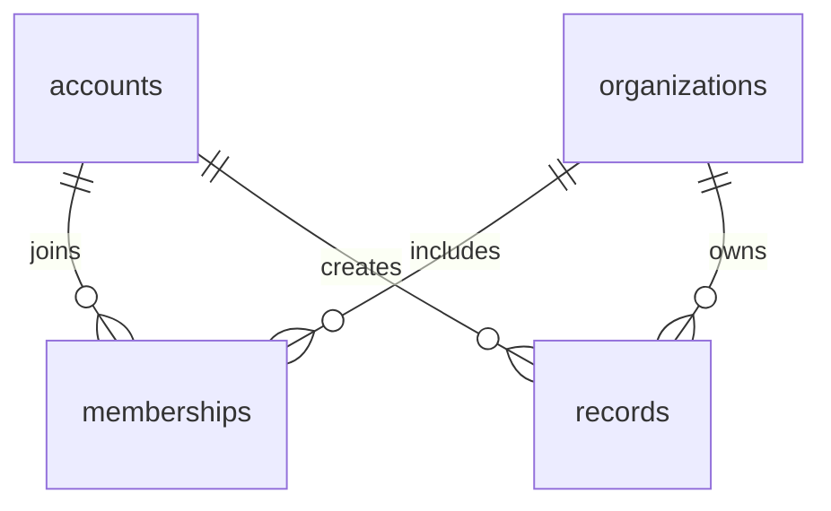

# Organization schema: CEC boundary

The app still serves CEC only. The schema now distinguishes global identity from
organization membership and explicitly restricts CEC endpoints and auxiliary data.

## Tables and compatibility views

- `accounts`: identity, credentials and existing profile fields; no global role.
- `organizations`: identity, unique slug, name, active/inactive status.
- `memberships`: unique `(organization_id,user_id)`, role, status, joined/left dates.
  Roles are applicant/member/officer; statuses pending/active/left/suspended.
- `records`: existing item data and versions plus organization ownership. This
  contains events, tasks, projects and the other legacy item kinds.
- `users`: CEC directory view joining accounts to memberships. Historical departures
  project as alumni for asset succession; session and member checks exclude them.
- `items`: CEC records view. Inserts/updates are constrained to CEC; direct API
  organization overrides cannot route requests into another organization.
- `organization_tables`: declares auxiliary tables as CEC-owned. They are not
  available for storing another club's data. Initialization installs guards on
  account/record foreign keys and known polymorphic identity columns.

Foreign keys target physical `accounts`/`records` tables. Database triggers enforce
record-owner membership, task assignee/project organization, deal contact organization,
and expected parent kind and membership on RSVPs/bookings/responses/submissions.
Membership identity cannot be reassigned/deleted; departure changes status. Removing
personal data requires a governed erasure migration rather than ad hoc deletion.
Historical records retain their actors and assignees after departure. New assignment
validation requires a current member. Old role objects do not grant officer access.

Core operational child tables, audit and outbox include `organization_id`, constrained
to CEC. New outbox envelopes identify their organization; migration tags old envelopes.
The analytics worker currently supports CEC only and refuses another organization.

## Migration and recovery

The initial migration records version 1 in `schema_migrations`. It backfills existing users/records,
renames physical tables, preserves IDs/data/versions and runs foreign-key and legacy
relationship validation in a transaction. Invalid task links fail with rollback.
Existing alumni become left members. Legacy joined timestamps default to migration
time; do not interpret those backfilled dates as verified historical joining dates.

Take a pipeline backup before first startup of this version. Test an offline restore
first, then start the app; the first database access migrates it. Old application code
must not be restarted against the upgraded database. To roll back, stop both app and
worker and restore the paired pre-migration backup to a new directory as described
in [pipeline operations](26-pipeline-operations.md). Later writes will not be in that
older snapshot. No automatic downgrade is supplied.

## Remaining limits

This does not enable general multi-club hosting. Before exposing another club, migrate
CEC-owned auxiliary tables to row-level organization scope, add selected-organization
routes, handle existing-account joins, scope recruitment cycles and profile-sharing
grants, and expand analytics to organization-specific authorization. Global profile
fields are legacy CEC behavior, not independent sharing grants for multiple clubs.

Task/project relations still live inside JSON and are enforced using database
triggers, not separate typed task/project tables. Several polymorphic auxiliary
relationships remain text IDs; guards block known foreign-organization identities
but do not establish that every arbitrary external reference exists. Normalize
those relationships when their workflows are expanded.

## Email schema (migration 3)

Additive account_email, email_tokens and email_jobs tables link to accounts; all remain
CEC-scoped through the existing guards. Mailbox verification never modifies membership
roles or restores access. See [email data and restore contracts](30-outgoing-email.md).
